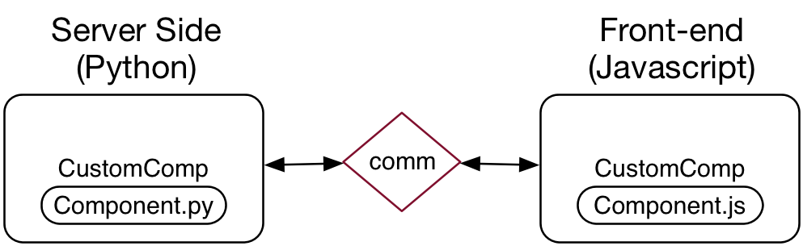

# jupyter-react

This repo actually has nothing to do with React, but rather is a base class meant for pairing up with JS based front-end UI components (see https://github.com/timbr-io/jupyter-react-js). The only thing in this module is a "Component" class. This class can be created with a "module" name that matches the name of a JS UI component and opens up a line of commuination called an "IPython Comm". Using the comm messages can be pased back and forth and property and actions can be taken as a result of UI interaction. 



## Example

```python
# Create a custom module in python 
 
from jupyter_react import Component 

class MyThing(Component):
    module = 'AnyJSClassName'
    comm_channel = 'custom.name'

    def __init__(self, **kwargs):
        super(MyThing, self).__init__(target_name='custom.name', **kwargs)
        self.on_msg(self._handle_msg)

    def _handle_msg(self, msg):
        print msg      
```

```python
# In Jupyter / IPython instantiate the class and display it

from mything import MyThing
from IPython.display import display

mything = MyThing(props={})
display(mything)
```

Once a component is "displayed" a message is passed over the comm to the front-end. If the front-end has registered a handler for the same `comm target\_name` then it will be called when the class is created. You can see more about how to build the front-end code here: https://github.com/timbr-io/jupyter-react-js.
